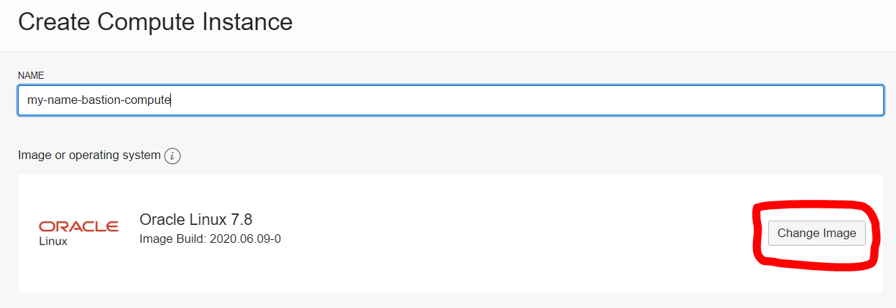
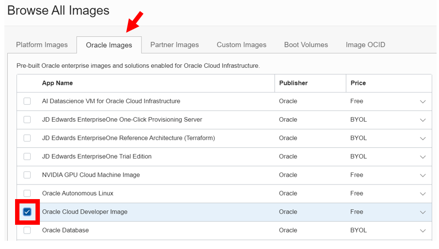
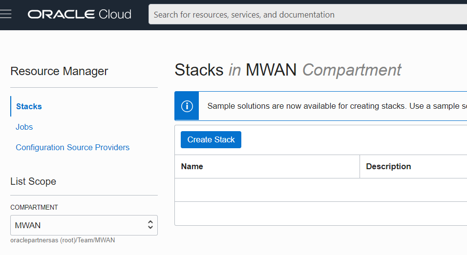
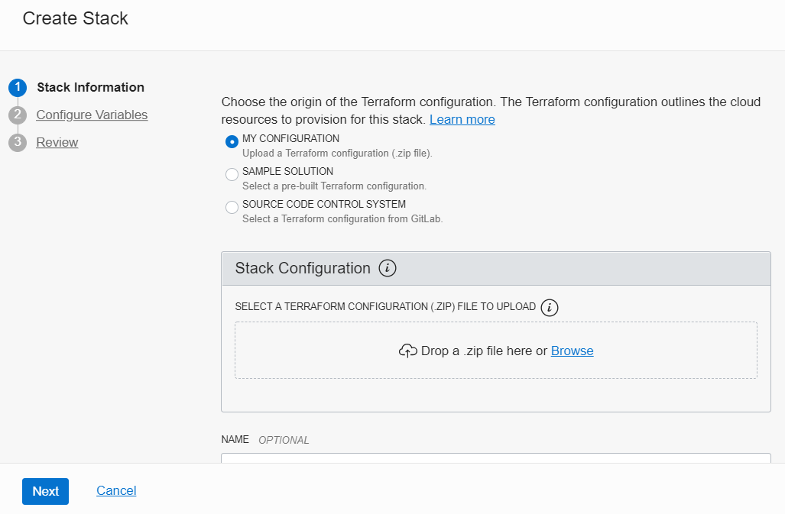
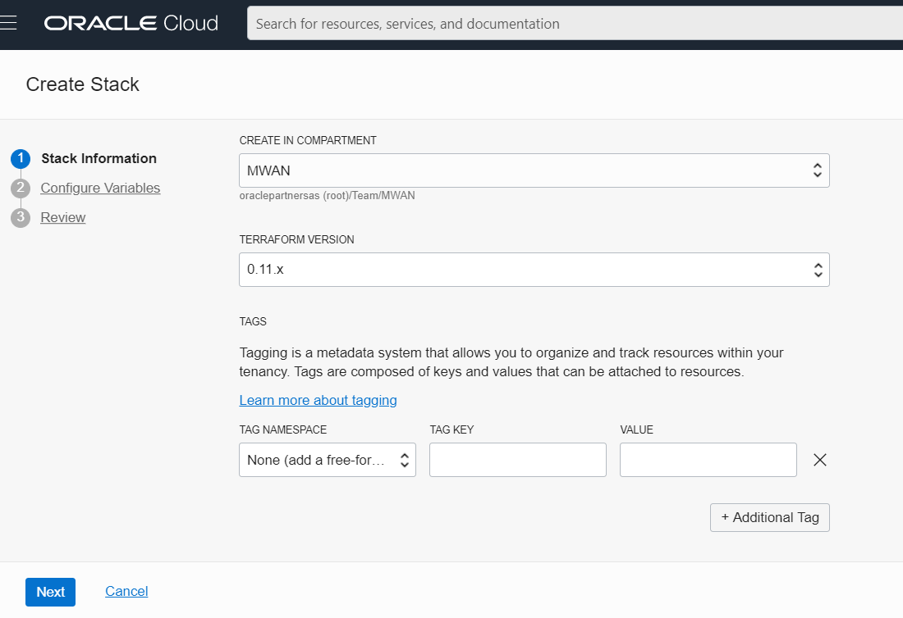
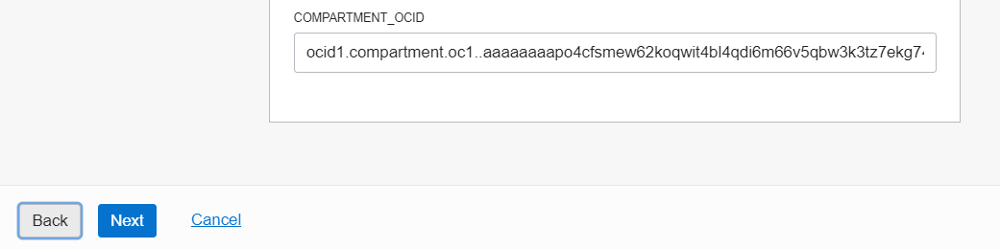
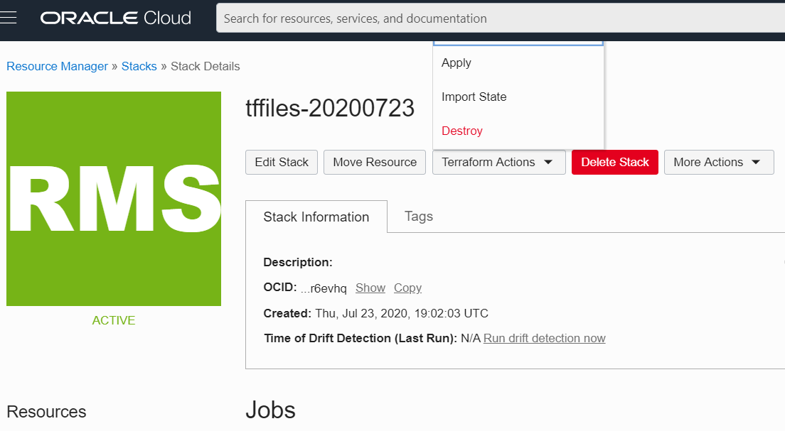
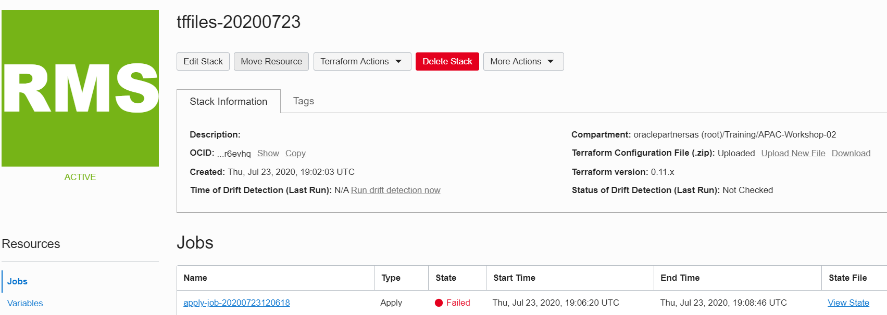
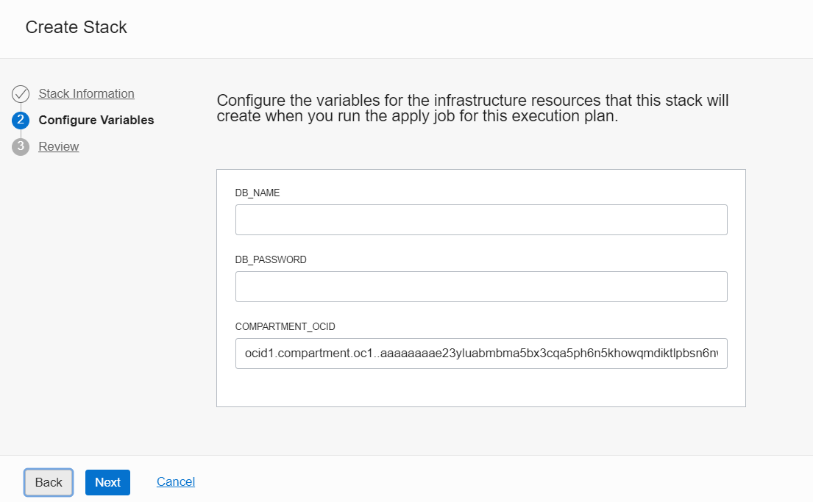

# Terraform OCI Resource Discovery and Export #

The steps below show you how to discover OCI resources from compartments and export them to terraform configuration files.  The exported configuration files can then be used with the OCI Resource Manager to recreate the environment.  

A typical use case is to use the OCI console to design the initial cloud environment and resources.  Then discover and export the design so that you can recreate the environment easily.  ie: for test, development, or production environments, or simply to backup the entire cloud configuration.

## Disclaimer ##
The following is intended to outline our general product direction. It is intended for information purposes only, and may not be incorporated into any contract. It is not a commitment to deliver any material, code, or functionality, and should not be relied upon in making purchasing decisions. The development, release, and timing of any features or functionality described for Oracle’s products remains at the sole discretion of Oracle.

## Requirements ##

- Oracle Cloud Account
- SSH client

## Step 1 - Prepare for the Export ##

To use the terraform provider to export the OCI resources we need to gather the following information from your OCI account.  The export works on compartments.

Find and Save the OCID's to a Text File.

1. user ocid
2. tenancy ocid
3. existing compartment ocid of OCI resources you want to export
4. new compartment ocid where you want to recreate the OCI resources.  Create the compartment if you have not done so.

## Step 2 - OCI and Terraform tools ##

You will need to have the OCI tools and Terraform provider installed on a compute.   The example below uses an OCI compute with the Cloud Developer image.  The Cloud Developer image has these tools pre-installed.

1. Create a compute instance in an existing compartment and VCN

2. Change the default Linux image to Cloud Developer image

   



 3. After provisioning the compute, ssh to the instance

 4. Check the oci version

    ```
    [opc@dev-instance .oci]$ oci --version
    2.6.11
    ```

5. Check Terraform provider is installed

   ```
   [opc@dev-instance ~]$ ls /usr/bin/ter*
   /usr/bin/terraform  /usr/bin/terraform-provider-oci_v3.51.0
   ```

6. Run the oci setup config to configure access to your tenancy.  Enter your OCIDs and the region where you want to export your OCI resources.  This setup will also ask you to generate an RSA key pair for the API key.  You will need to upload the public key when you create the API key through the OCI console.

   ```
   [opc@dev-instance .oci]$ oci setup config
   Enter a location for your config [/home/opc/.oci/config]:
   Enter a user OCID: ocid1.user.oc1..aaaaaaaawfpzqgzsrvb4mh......
   Enter a tenancy OCID: ocid1.tenancy.oc1..aaaaaaaafj37mytx22oquorcznlfuh77cd45in......
   Enter a region (e.g. ap-mumbai-1, ap-seoul-1, ap-sydney-1, ap-tokyo-1, ca-toronto-1, eu-frankfurt-1, eu-zurich-1, sa-saopaulo-1, uk-london-1, us-ashburn-1, us-gov-ashburn-1, us-gov-chicago-1, us-gov-phoenix-1, us-langley-1, us-luke-1, us-phoenix-1): ap-seoul-1
   Do you want to generate a new RSA key pair? (If you decline you will be asked to supply the path to an existing key.) [Y/n]: Y
   Enter a directory for your keys to be created [/home/opc/.oci]:
   Enter a name for your key [oci_api_key]:
   Public key written to: /home/opc/.oci/oci_api_key_public.pem
   Enter a passphrase for your private key (empty for no passphrase):
   Private key written to: /home/opc/.oci/oci_api_key.pem
   Fingerprint: 4a:33:25:66:13:b1:51:c3:74:48:.....
   Config written to /home/opc/.oci/config
   
   
       If you haven't already uploaded your public key through the console,
       follow the instructions on the page linked below in the section 'How to
       upload the public key':
   
           https://docs.cloud.oracle.com/Content/API/Concepts/apisigningkey.htm#How2
   
   ```

   

7. Check the results of the setup.

   ```
   [opc@dev-instance ~]$ ls
   [opc@dev-instance ~]$ cd .oci
   [opc@dev-instance .oci]$ ls
   config  oci_api_key.pem  oci_api_key_public.pem
   [opc@ dev-instance .oci]$ more config
   [DEFAULT]
   user=ocid1.user.oc1..aaaaaaaawfpzqgzsrvb4mh6hcld2hrckadyae5yvmyw6f5....
   fingerprint=fe:6e:6c:12:df:21:2d:30:6f:40:c4:....
   key_file=/home/opc/.oci/oci_api_key.pem
   tenancy=ocid1.tenancy.oc1..aaaaaaaafj37mytx22oquorcznlfuh77cd45int7tt7....
   region=ap-seoul-1
   
   ```

   

## Step 3 - Create the API key ##

The API key allows secure access to your tenancy resources.

1. From your OCI console, select User Settings from the top right drop down menu
2. Select API Keys
3. Click Add Public Key
4. Browse or paste oci_api_key_public.pem and click add 

We can now test api access to your tenancy.

```
[opc@dev-instance ~]$ oci os ns get
{
  "data": "YourTenancy"
}

```

## Step 4 - Discover and Export OCI Resources

You can now discover and export your OCI resources in a specific compartment by running the export command.   

1. Specify the OCID of the compartment where you want resources to be exported.  

2. Enter a path for the terraform configuration files to be output.

```
[opc@dev-instance ~]$ terraform-provider-oci_v3.51.0 -command=export -compartment_id=ocid1.compartment.oc1..aaaaaaaae23yluabmbma5bx3cqa5ph6n......-output_path=/home/opc/tfoutput
[opc@ dev-instance ~]$ cd /home/opc/tfoutput
[opc@ dev-instance tfoutput]$ ls
availability_domain.tf  database.tf       object_storage.tf  
core.tf                 load_balancer.tf  tagging.tf         vars.tf
[opc@ dev-instance tfoutput]$

```

Examine your exported terraform files. You will need to make a few edits to the files such as setting a variable for the database password.  We can do this after creating an OCI Resource Manager Stack. Applying it and seeing the error.

3. Zip up all the files

```
[opc@ dev-instance tfoutput]$ zip tffiles.zip *
```

4. Copy the zip file to your local drive by using WinSCP or equivalent for your computer.

## Step 5 - OCI Resource Manager

1. From the OCI Cloud Console select Resource Manager

2. Create Stack

   

3. Select the zip file

   

4. Enter compartment where you want to put the terraform configuration file 

   

5. Click Next

6. Enter the compartment where you want to create the new resources.  Simply paste your new compartment.

   

7. Click Next

8. Go back to Resource Manager Stacks 

9. Select the stack and apply

   

After applying you will get an error in the log to set your database password.  


## Step 6 - Add Variables to your Terraform Configuration file

1. Edit the database.tf file

2. Replace the database password and display and DB name with variables

   ```
   admin_password = "${var.db_password}"
   db_name = "${var.db_name}"
   display_name = "${var.db_name}"
   ```

We also need to edit the vars.tf file.

3. Add the variables

   ```
   variable db_name {}
   variable db_password {}
   ```

4. Zip the tf files again and copy to your local drive.

5. Go back to your Resource Manager job and upload new file.

   

You should now be prompted for your DB display and DB password name variables.



6. Enter your DB name and DB password

7. Re-apply the stack job.  If there are no more errors, your configuration has now been recreated in your new compartment.

   

   
   
   - **Author** - Milton Wan, Database Product Management, July 2020
   
   

 

 

 

 

 